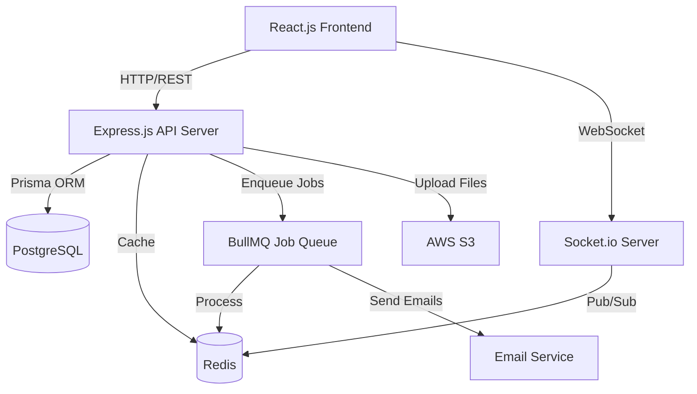
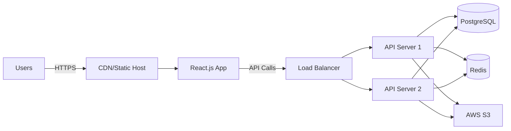

# Design Document: Study Up Platform

## Overview

Study Up is a full-stack web application that connects students through intelligent matching algorithms. The platform consists of a React.js frontend with TypeScript and Tailwind CSS, an Express.js backend with Socket.io for real-time features, PostgreSQL database managed through Prisma ORM, Redis for caching and job queues, and AWS S3 for file storage.

The architecture follows a client-server model with clear separation between presentation (React.js), business logic (Express.js services), data access (Prisma repositories), and real-time communication (Socket.io). The system emphasizes scalability, security, and maintainability through modular design patterns.

## Architecture

### High-Level Architecture



### Technology Stack

**Frontend:**
- React.js 18 - UI library for building user interfaces
- React Router - Client-side routing
- TypeScript - Type safety and developer experience
- Tailwind CSS - Utility-first styling
- shadcn/ui - Accessible component library
- Socket.io Client - Real-time communication
- React Query (TanStack Query) - Server state management
- Zod - Runtime validation
- Vite - Build tool and development server

**Backend:**
- Express.js - Web application framework
- Socket.io - Real-time bidirectional communication
- Prisma - Type-safe ORM
- PostgreSQL - Relational database
- Redis - Caching and pub/sub
- BullMQ - Job queue for background tasks
- JWT - Authentication tokens
- bcrypt - Password hashing
- Multer - File upload handling
- AWS SDK - S3 file storage

**DevOps:**
- Docker Compose - Local development environment
- Netlify or Vercel - Frontend deployment (static hosting)
- Railway - Backend and database hosting
- GitHub Actions - CI/CD pipeline

### Deployment Architecture



## Components and Interfaces

### Frontend Components

**1. Authentication Module**
- `LoginForm`: Email/password login with validation
- `RegisterForm`: User registration with OAuth options
- `OAuthButtons`: Google/Microsoft/GitHub authentication
- `ProtectedRoute`: Component wrapper for authenticated routes
- `AuthProvider`: Context provider for authentication state

**2. Profile Module**
- `ProfileForm`: Edit profile fields (subjects, goals, availability)
- `ProfileCompletionBar`: Visual progress indicator
- `SubjectSelector`: Multi-select for subjects
- `AvailabilityPicker`: Weekly schedule grid
- `LearningStyleSelector`: Radio group for learning preferences

**3. Recommendation Module**
- `RecommendationCard`: Display user with compatibility score
- `RecommendationGrid`: Grid layout of recommendations
- `FilterSidebar`: Subject, availability, learning style filters
- `SearchBar`: Name/subject search input
- `CompatibilityBadge`: Visual score indicator

**4. Connection Module**
- `ConnectionRequestButton`: Send connection request
- `ConnectionRequestList`: Pending sent/received requests
- `ConnectionGrid`: Display accepted connections
- `ConnectionStatusBadge`: Visual status indicator

**5. Chat Module**
- `ChatSidebar`: List of conversations
- `ChatWindow`: Message display and input
- `MessageBubble`: Individual message component
- `FileAttachment`: File upload and display
- `TypingIndicator`: Real-time typing status

**6. Session Module**
- `SessionCalendar`: Calendar view of sessions
- `SessionForm`: Create/edit session modal
- `SessionCard`: Display session details
- `SessionInvite`: Participant selector
- `RecurringOptions`: Recurrence pattern selector

**7. Dashboard Module**
- `StatsCards`: Metrics display (buddies, hours, rating)
- `UpcomingSessionsList`: Next sessions
- `TopRecommendations`: Top 4 matches
- `ActivityChart`: Study time visualization
- `ExportButton`: CSV export functionality

**8. Feedback Module**
- `RatingStars`: 1-5 star selector
- `FeedbackForm`: Rating and comment input
- `FeedbackPrompt`: Post-session modal

**9. Notification Module**
- `NotificationBell`: Icon with unread count
- `NotificationDropdown`: List of notifications
- `NotificationItem`: Individual notification

### Backend Services

**1. AuthService**
```typescript
interface AuthService {
  register(email: string, password: string, name: string): Promise<{user: User, token: string}>
  login(email: string, password: string): Promise<{user: User, token: string}>
  validateToken(token: string): Promise<User>
  hashPassword(password: string): Promise<string>
  comparePassword(password: string, hash: string): Promise<boolean>
  generateJWT(userId: string): string
}
```

**2. RecommendationService**
```typescript
interface RecommendationService {
  getRecommendations(userId: string, filters?: Filters): Promise<Recommendation[]>
  calculateCompatibilityScore(user1: Profile, user2: Profile): number
  calculateSubjectMatch(subjects1: string[], subjects2: string[]): number
  calculateGoalSimilarity(goals1: string[], goals2: string[]): number
  calculateScheduleOverlap(avail1: Schedule, avail2: Schedule): number
  calculateStyleMatch(style1: string, style2: string): number
}
```

**3. ConnectionService**
```typescript
interface ConnectionService {
  sendRequest(requesterId: string, receiverId: string, message?: string): Promise<Connection>
  acceptRequest(connectionId: string): Promise<Connection>
  declineRequest(connectionId: string): Promise<Connection>
  getConnections(userId: string): Promise<Connection[]>
  getPendingRequests(userId: string): Promise<Connection[]>
  checkConnection(user1Id: string, user2Id: string): Promise<boolean>
}
```

**4. ChatService**
```typescript
interface ChatService {
  sendMessage(senderId: string, receiverId: string, content: string, fileUrl?: string): Promise<Message>
  getMessages(userId: string, otherUserId: string, limit?: number): Promise<Message[]>
  markAsRead(messageId: string): Promise<void>
  getConversations(userId: string): Promise<Conversation[]>
}
```

**5. SessionService**
```typescript
interface SessionService {
  createSession(data: SessionInput): Promise<StudySession>
  updateSession(sessionId: string, data: Partial<SessionInput>): Promise<StudySession>
  deleteSession(sessionId: string): Promise<void>
  getSessions(userId: string, startDate?: Date, endDate?: Date): Promise<StudySession[]>
  sendReminders(sessionId: string): Promise<void>
  createRecurringSessions(data: RecurringSessionInput): Promise<StudySession[]>
}
```

**6. ResourceService**
```typescript
interface ResourceService {
  uploadResource(userId: string, file: File, metadata: ResourceMetadata): Promise<Resource>
  getResources(userId: string, connectionId?: string): Promise<Resource[]>
  deleteResource(resourceId: string): Promise<void>
  generateDownloadUrl(resourceId: string): Promise<string>
}
```

**7. FeedbackService**
```typescript
interface FeedbackService {
  submitFeedback(data: FeedbackInput): Promise<Feedback>
  getFeedback(userId: string): Promise<Feedback[]>
  updateAverageRating(userId: string): Promise<number>
}
```

**8. NotificationService**
```typescript
interface NotificationService {
  sendNotification(userId: string, type: NotificationType, data: any): Promise<void>
  getNotifications(userId: string, unreadOnly?: boolean): Promise<Notification[]>
  markAsRead(notificationId: string): Promise<void>
  checkDailyLimit(userId: string): Promise<boolean>
  queueNotification(userId: string, notification: Notification): Promise<void>
}
```

**9. DashboardService**
```typescript
interface DashboardService {
  getStats(userId: string): Promise<DashboardStats>
  getActivityData(userId: string, startDate: Date, endDate: Date): Promise<ActivityData>
  exportData(userId: string): Promise<string> // CSV content
}
```

### API Endpoints

**Authentication**
- `POST /api/v1/auth/register` - Register new user
- `POST /api/v1/auth/login` - Login user
- `POST /api/v1/auth/oauth/:provider` - OAuth authentication
- `POST /api/v1/auth/refresh` - Refresh JWT token

**Users & Profiles**
- `GET /api/v1/users/me` - Get current user
- `PUT /api/v1/users/me` - Update current user
- `GET /api/v1/users/:id` - Get user by ID
- `PUT /api/v1/users/me/profile` - Update profile
- `GET /api/v1/users/me/profile/completion` - Get completion percentage

**Recommendations**
- `GET /api/v1/recommendations` - Get recommendations with filters
- `GET /api/v1/recommendations/:userId/score` - Get compatibility score

**Connections**
- `POST /api/v1/connections/request` - Send connection request
- `PUT /api/v1/connections/:id/accept` - Accept request
- `PUT /api/v1/connections/:id/decline` - Decline request
- `GET /api/v1/connections` - Get all connections
- `GET /api/v1/connections/pending` - Get pending requests

**Messages**
- `POST /api/v1/messages` - Send message
- `GET /api/v1/messages/:userId` - Get conversation
- `PUT /api/v1/messages/:id/read` - Mark as read
- `GET /api/v1/messages/conversations` - Get all conversations

**Sessions**
- `POST /api/v1/sessions` - Create session
- `PUT /api/v1/sessions/:id` - Update session
- `DELETE /api/v1/sessions/:id` - Delete session
- `GET /api/v1/sessions` - Get user sessions
- `POST /api/v1/sessions/recurring` - Create recurring sessions

**Resources**
- `POST /api/v1/resources` - Upload resource
- `GET /api/v1/resources` - Get resources
- `DELETE /api/v1/resources/:id` - Delete resource
- `GET /api/v1/resources/:id/download` - Get download URL

**Feedback**
- `POST /api/v1/feedback` - Submit feedback
- `GET /api/v1/feedback/:userId` - Get user feedback

**Dashboard**
- `GET /api/v1/dashboard/stats` - Get dashboard stats
- `GET /api/v1/dashboard/activity` - Get activity data
- `GET /api/v1/dashboard/export` - Export CSV

**Notifications**
- `GET /api/v1/notifications` - Get notifications
- `PUT /api/v1/notifications/:id/read` - Mark as read
- `PUT /api/v1/notifications/read-all` - Mark all as read

### Socket.io Events

**Client → Server**
- `join_room` - Join user's personal room
- `send_message` - Send chat message
- `typing_start` - User started typing
- `typing_stop` - User stopped typing
- `mark_online` - User is online
- `mark_offline` - User is offline

**Server → Client**
- `new_message` - New message received
- `message_read` - Message was read
- `user_typing` - Other user is typing
- `user_online` - User came online
- `user_offline` - User went offline
- `new_notification` - New notification
- `connection_request` - New connection request
- `connection_accepted` - Connection was accepted
- `session_reminder` - Session reminder

## Data Models

### Database Schema (Prisma)

```prisma
model User {
  id            String          @id @default(uuid())
  email         String          @unique
  passwordHash  String?
  name          String
  username      String          @unique
  emailVerified Boolean         @default(false)
  oauthProvider String?
  oauthId       String?
  createdAt     DateTime        @default(now())
  updatedAt     DateTime        @updatedAt
  
  profile              Profile?
  sentConnections      Connection[]     @relation("requester")
  receivedConnections  Connection[]     @relation("receiver")
  sentMessages         Message[]        @relation("sender")
  receivedMessages     Message[]        @relation("receiver")
  createdSessions      StudySession[]   @relation("creator")
  resources            Resource[]
  givenFeedback        Feedback[]       @relation("rater")
  receivedFeedback     Feedback[]       @relation("rated")
  notifications        Notification[]
  
  @@index([email])
  @@index([username])
}

model Profile {
  id             String   @id @default(uuid())
  userId         String   @unique
  subjects       Json     // ["Math", "Physics", "Chemistry"]
  goals          Json     // ["Exam Prep", "Homework Help"]
  availability   Json     // {"monday": ["14:00-16:00", "18:00-20:00"]}
  learningStyle  String?  // "visual", "auditory", "kinesthetic", "reading"
  avgRating      Float    @default(0)
  bio            String?  @db.Text
  completionPct  Int      @default(0)
  createdAt      DateTime @default(now())
  updatedAt      DateTime @updatedAt
  
  user User @relation(fields: [userId], references: [id], onDelete: Cascade)
  
  @@index([userId])
}

model Connection {
  id          String   @id @default(uuid())
  requesterId String
  receiverId  String
  status      String   @default("pending") // "pending", "accepted", "declined"
  message     String?  @db.Text
  createdAt   DateTime @default(now())
  updatedAt   DateTime @updatedAt
  
  requester User @relation("requester", fields: [requesterId], references: [id], onDelete: Cascade)
  receiver  User @relation("receiver", fields: [receiverId], references: [id], onDelete: Cascade)
  
  @@unique([requesterId, receiverId])
  @@index([requesterId])
  @@index([receiverId])
  @@index([status])
}

model Message {
  id         String    @id @default(uuid())
  senderId   String
  receiverId String
  content    String    @db.Text
  fileUrl    String?
  fileName   String?
  sentAt     DateTime  @default(now())
  readAt     DateTime?
  
  sender   User @relation("sender", fields: [senderId], references: [id], onDelete: Cascade)
  receiver User @relation("receiver", fields: [receiverId], references: [id], onDelete: Cascade)
  
  @@index([senderId, receiverId])
  @@index([sentAt])
}

model StudySession {
  id           String   @id @default(uuid())
  creatorId    String
  title        String
  subject      String
  description  String?  @db.Text
  dateTime     DateTime
  duration     Int      // minutes (15-480)
  participants Json     // ["userId1", "userId2"]
  status       String   @default("scheduled") // "scheduled", "completed", "cancelled"
  isRecurring  Boolean  @default(false)
  recurrenceId String?
  createdAt    DateTime @default(now())
  updatedAt    DateTime @updatedAt
  
  creator  User       @relation("creator", fields: [creatorId], references: [id], onDelete: Cascade)
  feedback Feedback[]
  
  @@index([creatorId])
  @@index([dateTime])
  @@index([status])
}

model Resource {
  id          String   @id @default(uuid())
  userId      String
  fileName    String
  fileType    String
  fileSize    Int      // bytes
  fileUrl     String
  s3Key       String
  sharedWith  Json     // ["userId1", "userId2"]
  uploadedAt  DateTime @default(now())
  
  user User @relation(fields: [userId], references: [id], onDelete: Cascade)
  
  @@index([userId])
}

model Feedback {
  id           String   @id @default(uuid())
  sessionId    String
  raterId      String
  ratedUserId  String
  rating       Int      // 1-5
  comment      String?  @db.Text
  createdAt    DateTime @default(now())
  
  session    StudySession @relation(fields: [sessionId], references: [id], onDelete: Cascade)
  rater      User         @relation("rater", fields: [raterId], references: [id], onDelete: Cascade)
  ratedUser  User         @relation("rated", fields: [ratedUserId], references: [id], onDelete: Cascade)
  
  @@index([sessionId])
  @@index([ratedUserId])
}

model Notification {
  id        String    @id @default(uuid())
  userId    String
  type      String    // "connection_request", "message", "session_reminder", etc.
  title     String
  message   String    @db.Text
  data      Json?     // Additional context data
  read      Boolean   @default(false)
  sentAt    DateTime  @default(now())
  readAt    DateTime?
  
  user User @relation(fields: [userId], references: [id], onDelete: Cascade)
  
  @@index([userId, read])
  @@index([sentAt])
}
```

### Type Definitions

```typescript
// Recommendation types
interface Recommendation {
  user: User
  profile: Profile
  compatibilityScore: number
  matchDetails: {
    subjectMatch: number
    goalSimilarity: number
    scheduleOverlap: number
    styleMatch: number
    ratingBonus: number
  }
}

interface Filters {
  subjects?: string[]
  availability?: string[]
  learningStyle?: string
  minScore?: number
}

// Session types
interface SessionInput {
  title: string
  subject: string
  description?: string
  dateTime: Date
  duration: number
  participants: string[]
}

interface RecurringSessionInput extends SessionInput {
  recurrencePattern: 'daily' | 'weekly' | 'biweekly' | 'monthly'
  recurrenceEnd: Date
}

// Dashboard types
interface DashboardStats {
  totalBuddies: number
  totalStudyHours: number
  averageRating: number
  upcomingSessions: StudySession[]
  topRecommendations: Recommendation[]
}

interface ActivityData {
  studyTimeByDay: { date: string; hours: number }[]
  sessionsBySubject: { subject: string; count: number }[]
  ratingTrend: { date: string; rating: number }[]
}

// Notification types
type NotificationType = 
  | 'connection_request'
  | 'connection_accepted'
  | 'new_message'
  | 'session_reminder'
  | 'session_invite'
  | 'feedback_received'

interface NotificationData {
  type: NotificationType
  title: string
  message: string
  actionUrl?: string
  metadata?: any
}
```

## Correctness Properties

*A property is a characteristic or behavior that should hold true across all valid executions of a system—essentially, a formal statement about what the system should do. Properties serve as the bridge between human-readable specifications and machine-verifiable correctness guarantees.*


### Authentication and Registration Properties

**Property 1: Valid registration creates user and token**
*For any* valid registration credentials (email, password with 8+ chars including uppercase, lowercase, number, special symbol, and name), submitting registration should create a new User account and return a valid JWT token.
**Validates: Requirements 1.1**

**Property 2: Duplicate email rejection**
*For any* existing User email, attempting to register with that email should reject the registration and return an error message.
**Validates: Requirements 1.2**

**Property 3: Password validation**
*For any* password string, the system should accept it only if it contains at least 8 characters including at least one uppercase letter, one lowercase letter, one number, and one special symbol.
**Validates: Requirements 1.3**

**Property 4: Valid login returns token**
*For any* registered User with valid credentials, submitting login should authenticate the User and return a JWT token with 24-hour expiry.
**Validates: Requirements 1.5**

**Property 5: Invalid login rejection**
*For any* invalid login credentials (wrong email or password), authentication should be rejected with an error message.
**Validates: Requirements 1.6**

**Property 6: Age restriction enforcement**
*For any* User registration attempt with age under 13, the system should prevent account creation.
**Validates: Requirements 1.7**

### Profile Management Properties

**Property 7: Profile data completeness**
*For any* User accessing their Profile, the response should include all required fields: subjects, goals, availability, learning style, and completion percentage.
**Validates: Requirements 2.1**

**Property 8: Profile update persistence**
*For any* Profile update, the system should save all changes and recalculate the Profile Completion percentage to reflect the new state.
**Validates: Requirements 2.2**

**Property 9: Subject validation**
*For any* Profile save operation, the system should accept subjects only if they exist in the predefined subject list.
**Validates: Requirements 2.3**

**Property 10: Availability storage format**
*For any* availability schedule set by a User, the stored data should be in JSON format with day-of-week keys and time range arrays as values.
**Validates: Requirements 2.4**

**Property 11: Recommendation access threshold**
*For any* User, access to the Recommendation Engine should be blocked when Profile Completion is below 60% and enabled when at or above 60%.
**Validates: Requirements 2.5, 2.6**

### Recommendation Engine Properties

**Property 12: Compatibility score calculation**
*For any* two User profiles, the Compatibility Score should equal exactly: 0.4×subject_match + 0.25×goal_similarity + 0.2×schedule_overlap + 0.1×style_match + 0.05×avg_rating.
**Validates: Requirements 3.1**

**Property 13: Low rating penalty**
*For any* User with average rating below 2.0 stars, their Compatibility Score in recommendations should be multiplied by 0.7.
**Validates: Requirements 3.2**

**Property 14: Recommendation response structure**
*For any* recommendation returned, it should include User name, avatar, subjects, and Compatibility Score as a percentage.
**Validates: Requirements 3.3**

**Property 15: Recommendation filtering**
*For any* filter criteria (subjects, availability, or learning style), the recommendations should return only Users matching all specified filters.
**Validates: Requirements 3.4, 14.2, 14.4, 14.5**

**Property 16: Search result ordering**
*For any* search query by name or subject, results should match the query and be ordered by Compatibility Score in descending order.
**Validates: Requirements 3.5, 14.1**

### Connection Management Properties

**Property 17: Connection request creation**
*For any* valid User pair, sending a Connection request should create a Connection record with status "pending".
**Validates: Requirements 4.1**

**Property 18: Duplicate request prevention**
*For any* existing pending Connection request, attempting to send another request between the same Users should be rejected with "Request pending" message.
**Validates: Requirements 4.2**

**Property 19: Connection acceptance**
*For any* pending Connection, accepting it should update the status to "accepted" and enable chat and resource sharing between the Users.
**Validates: Requirements 4.3**

**Property 20: Connection decline**
*For any* pending Connection, declining it should update the status to "declined" and remove it from pending request lists.
**Validates: Requirements 4.4**

**Property 21: Connection list organization**
*For any* User viewing connections, the response should contain separate lists for pending sent requests, pending received requests, and accepted connections.
**Validates: Requirements 4.5**

**Property 22: Connection-based access control**
*For any* two Users, chat and resource sharing features should be accessible only when an accepted Connection exists between them.
**Validates: Requirements 4.6, 6.4, 6.5**

### Chat System Properties

**Property 23: File attachment validation**
*For any* file attached to a message, the system should accept it only if the file size is 50 megabytes or less and the file type is PDF, DOC, PPT, XLS, image, or TXT.
**Validates: Requirements 5.2, 6.1, 6.2, 13.1, 13.2**

**Property 24: Oversized file rejection**
*For any* file exceeding 50 megabytes, the upload should be rejected with "≤50MB, PDF/DOC/images only" error message.
**Validates: Requirements 5.3, 13.4**

**Property 25: Offline message persistence**
*For any* message sent to an offline User, the message should be stored and delivered when the recipient reconnects.
**Validates: Requirements 5.4**

**Property 26: Chat access control**
*For any* two Users without an accepted Connection, message sending should be prevented and return an error.
**Validates: Requirements 5.6**

**Property 27: Message chronological ordering**
*For any* chat history between two Users, messages should be displayed in chronological order by sentAt timestamp with all timestamps included.
**Validates: Requirements 5.7**

### Resource Sharing Properties

**Property 28: Resource storage and record creation**
*For any* valid resource file upload, the system should store the file in S3/Cloudinary with a unique identifier and create a resource record with fileName, fileType, fileSize, fileUrl, and uploadedAt.
**Validates: Requirements 6.3, 6.6, 13.3, 13.6**

**Property 29: Secure file access URL**
*For any* uploaded file access request, the system should generate a secure temporary URL for download.
**Validates: Requirements 13.5**

### Study Session Properties

**Property 30: Session participant validation**
*For any* Study Session creation attempt, the system should accept it only if at least one connected Study Buddy is included as a participant.
**Validates: Requirements 7.1**

**Property 31: Solo session rejection**
*For any* Study Session creation attempt with no participants or only the creator, the system should reject it with an error message.
**Validates: Requirements 7.2**

**Property 32: Session duration validation**
*For any* Study Session, the duration should be accepted only if it is between 15 and 480 minutes inclusive.
**Validates: Requirements 7.3**

**Property 33: Session invitation delivery**
*For any* created Study Session, calendar invitations should be sent to all participants.
**Validates: Requirements 7.4**

**Property 34: Recurring session generation**
*For any* Study Session created with recurring settings, the system should generate multiple session instances according to the recurrence pattern (daily, weekly, biweekly, monthly) until the recurrence end date.
**Validates: Requirements 7.5**

**Property 35: Session reminder scheduling**
*For any* Study Session, reminder notifications should be scheduled and sent to all participants when the start time approaches.
**Validates: Requirements 7.6**

**Property 36: Session response structure**
*For any* User's schedule view, all upcoming Study Sessions should include title, subject, date, time, and participants.
**Validates: Requirements 7.7**

### Dashboard and Analytics Properties

**Property 37: Dashboard statistics calculation**
*For any* User, the Activity Dashboard should display accurate counts of total Study Buddies (accepted connections), total study hours (sum of completed session durations), and average rating received.
**Validates: Requirements 8.1, 8.5**

**Property 38: Dashboard data structure**
*For any* User accessing the Activity Dashboard, the response should include upcoming Study Sessions and top 4 recommendations.
**Validates: Requirements 8.2**

**Property 39: Activity metrics calculation**
*For any* User requesting detailed metrics, the system should provide charts with study time trends, session frequency, and subject distribution calculated from their activity history.
**Validates: Requirements 8.3**

**Property 40: CSV export completeness**
*For any* User exporting activity data, the generated CSV should contain all session history, ratings received, and calculated metrics.
**Validates: Requirements 8.4**

### Feedback System Properties

**Property 41: Feedback prompt creation**
*For any* completed Study Session, the system should create feedback prompts for all participants.
**Validates: Requirements 9.1**

**Property 42: Rating validation**
*For any* Feedback submission, the rating should be accepted only if it is an integer between 1 and 5 inclusive.
**Validates: Requirements 9.2**

**Property 43: Feedback data persistence**
*For any* Feedback submission, the system should store the rating, optional comment, session ID, and rated User ID.
**Validates: Requirements 9.3**

**Property 44: Average rating recalculation**
*For any* new Feedback received by a User, the system should recalculate their average rating across all received Feedback.
**Validates: Requirements 9.4**

**Property 45: Rating propagation**
*For any* User's average rating update, the system should update their Profile and affect future Compatibility Score calculations.
**Validates: Requirements 9.5**

### Notification System Properties

**Property 46: Connection request notifications**
*For any* Connection request received, the system should send both email and in-app notifications to the receiver.
**Validates: Requirements 10.1**

**Property 47: Message notifications**
*For any* new message received, the system should send an in-app notification to the receiver.
**Validates: Requirements 10.2**

**Property 48: Session reminder notifications**
*For any* Study Session reminder trigger, the system should send both email and in-app notifications to all participants.
**Validates: Requirements 10.3**

**Property 49: Daily notification limit**
*For any* User, the total number of notifications sent in a 24-hour period should not exceed 10.
**Validates: Requirements 10.4**

**Property 50: Notification queuing**
*For any* User who has reached 10 notifications in a day, additional notifications should be queued for delivery the next day.
**Validates: Requirements 10.5**

**Property 51: Notification read status**
*For any* notification marked as read, the system should update the notification status to read and decrement the unread count.
**Validates: Requirements 10.6**

### Security Properties

**Property 52: Password hashing**
*For any* User password stored in the database, it should be hashed using bcrypt and never stored as plaintext.
**Validates: Requirements 12.1**

**Property 53: JWT token expiry**
*For any* User authentication, the issued JWT token should have an expiry time of exactly 24 hours from issuance.
**Validates: Requirements 12.2**

**Property 54: Account deletion compliance**
*For any* User requesting account deletion, the system should mark the account for deletion and complete data removal within 30 days.
**Validates: Requirements 12.5**

**Property 55: API rate limiting**
*For any* API endpoint, the system should enforce rate limits to prevent abuse by rejecting requests that exceed the configured threshold.
**Validates: Requirements 12.7**

### Availability Matching Property

**Property 56: Availability overlap detection**
*For any* two User availability schedules, filtering by availability should return Users only when there is at least one overlapping time slot on any day of the week.
**Validates: Requirements 14.3**

## Error Handling

### Error Categories

**1. Validation Errors (400 Bad Request)**
- Invalid email format
- Weak password (< 8 chars or missing required character types)
- Invalid file type or size
- Invalid rating value (not 1-5)
- Invalid session duration (< 15 or > 480 minutes)
- Profile completion below threshold
- Invalid subject not in predefined list

**2. Authentication Errors (401 Unauthorized)**
- Invalid credentials
- Expired JWT token
- Missing authentication token
- Invalid OAuth token

**3. Authorization Errors (403 Forbidden)**
- Attempting to access chat without connection
- Attempting to share resources without connection
- Attempting to modify another user's data
- Profile completion below 60% accessing recommendations

**4. Not Found Errors (404 Not Found)**
- User not found
- Connection not found
- Session not found
- Resource not found
- Message not found

**5. Conflict Errors (409 Conflict)**
- Duplicate email registration
- Duplicate connection request
- Username already taken

**6. Rate Limit Errors (429 Too Many Requests)**
- API rate limit exceeded
- Daily notification limit exceeded

**7. Server Errors (500 Internal Server Error)**
- Database connection failure
- S3 upload failure
- Email service failure
- Unexpected errors

### Error Response Format

All errors follow a consistent JSON structure:

```json
{
  "error": {
    "code": "ERROR_CODE",
    "message": "Human-readable error message",
    "details": {
      "field": "specific field that caused error",
      "constraint": "constraint that was violated"
    },
    "timestamp": "2024-01-15T10:30:00Z"
  }
}
```

### Error Handling Strategy

**Frontend:**
- Display user-friendly error messages
- Show validation errors inline on forms
- Toast notifications for async errors
- Retry logic for network failures
- Graceful degradation for non-critical features

**Backend:**
- Centralized error handling middleware
- Structured logging with error context
- Error monitoring and alerting
- Automatic retry for transient failures
- Circuit breaker for external services

**Database:**
- Transaction rollback on errors
- Constraint validation at database level
- Deadlock detection and retry
- Connection pool management

## Testing Strategy

### Unit Testing

**Coverage Target:** 80%+ code coverage

**Framework:** Jest for backend, Vitest for frontend

**Unit Test Focus:**
- Service layer business logic
- Utility functions (compatibility score calculation, validation)
- Data transformations
- Error handling paths
- Edge cases (empty inputs, boundary values)

**Example Unit Tests:**
- Password validation with various invalid inputs
- Compatibility score calculation with known inputs
- Profile completion percentage calculation
- Date/time utilities for session scheduling
- File type validation logic

### Property-Based Testing

**Framework:** fast-check (JavaScript/TypeScript property-based testing library)

**Configuration:** Minimum 100 iterations per property test

**Property Test Requirements:**
- Each correctness property from the design document MUST be implemented as a property-based test
- Each property test MUST be tagged with a comment: `// Feature: study-buddy-platform, Property {number}: {property_text}`
- Each property test MUST reference the requirements it validates
- Property tests MUST use smart generators that constrain inputs to valid ranges

**Generator Strategy:**
- `userGenerator`: Creates random valid users with profiles
- `profileGenerator`: Creates profiles with varying completion percentages
- `connectionGenerator`: Creates connection records in various states
- `messageGenerator`: Creates messages with optional file attachments
- `sessionGenerator`: Creates sessions with valid durations and participants
- `feedbackGenerator`: Creates feedback with ratings 1-5
- `availabilityGenerator`: Creates weekly schedules with time ranges

**Example Property Tests:**
- Property 12: Generate random user pairs, calculate compatibility score, verify formula
- Property 23: Generate random files, verify size/type validation
- Property 32: Generate random durations, verify 15-480 minute constraint
- Property 44: Generate random feedback, verify average rating calculation

### Integration Testing

**Framework:** Supertest for API testing, Playwright for E2E

**Integration Test Focus:**
- API endpoint workflows
- Database transactions
- Real-time Socket.io communication
- File upload to S3
- Email notification delivery
- Authentication flows

**Example Integration Tests:**
- Complete user registration → profile creation → recommendation flow
- Connection request → acceptance → chat message flow
- Session creation → reminder scheduling → feedback submission
- OAuth authentication flow with mock providers

### Performance Testing

**Framework:** k6 or Artillery

**Performance Test Focus:**
- API response times (P95 < 500ms)
- Concurrent user load (5000 users)
- Message delivery latency (< 200ms)
- Database query performance
- File upload throughput

### Security Testing

**Security Test Focus:**
- SQL injection prevention
- XSS prevention
- CSRF protection
- JWT token validation
- Rate limiting effectiveness
- Password hashing verification
- File upload security (malicious files)

### Test Data Management

**Seed Data:**
- 10 sample users with complete profiles
- Various connection states between users
- Sample messages and sessions
- Historical feedback data

**Test Database:**
- Separate test database instance
- Automatic cleanup between test runs
- Transaction rollback for unit tests
- Database migrations tested

### Continuous Integration

**CI Pipeline:**
1. Lint code (ESLint, Prettier)
2. Type check (TypeScript)
3. Run unit tests
4. Run property-based tests
5. Run integration tests
6. Generate coverage report
7. Build Docker images
8. Deploy to staging

**Quality Gates:**
- All tests must pass
- Code coverage ≥ 80%
- No TypeScript errors
- No high-severity linting errors

## Implementation Notes

### Compatibility Score Algorithm Details

The compatibility score calculation requires five sub-calculations:

**1. Subject Match (0-1):**
```typescript
subjectMatch = intersection(user1.subjects, user2.subjects).length / 
               union(user1.subjects, user2.subjects).length
```

**2. Goal Similarity (0-1):**
```typescript
goalSimilarity = intersection(user1.goals, user2.goals).length / 
                 max(user1.goals.length, user2.goals.length)
```

**3. Schedule Overlap (0-1):**
```typescript
// For each day, calculate overlapping time ranges
// Sum total overlapping minutes across all days
// Divide by total available minutes across all days
scheduleOverlap = totalOverlapMinutes / totalAvailableMinutes
```

**4. Style Match (0-1):**
```typescript
styleMatch = user1.learningStyle === user2.learningStyle ? 1 : 0
```

**5. Rating Component (0-1):**
```typescript
ratingComponent = user2.avgRating / 5.0
// Apply 0.7 multiplier if avgRating < 2.0
```

### Profile Completion Calculation

Profile completion is calculated based on required fields:

```typescript
const requiredFields = [
  'subjects',      // 20%
  'goals',         // 20%
  'availability',  // 20%
  'learningStyle', // 20%
  'bio'           // 20%
]

completionPct = requiredFields.reduce((sum, field) => {
  return sum + (profile[field] && profile[field].length > 0 ? 20 : 0)
}, 0)
```

### Real-Time Architecture

**Socket.io Rooms:**
- Each user joins a personal room: `user:{userId}`
- Each conversation has a room: `chat:{userId1}:{userId2}` (sorted IDs)
- Notifications broadcast to user rooms

**Message Flow:**
1. Client emits `send_message` with receiverId and content
2. Server validates connection exists
3. Server saves message to database
4. Server emits `new_message` to receiver's room
5. Server emits delivery confirmation to sender

**Presence Management:**
- Users emit `mark_online` on connection
- Server tracks online users in Redis set
- Users emit `mark_offline` on disconnect
- Heartbeat every 30 seconds to maintain presence

### File Upload Flow

1. Client requests upload URL from API
2. Server generates presigned S3 URL
3. Client uploads directly to S3
4. Client confirms upload to API
5. Server creates resource record
6. Server validates file was uploaded
7. Server returns resource metadata

### Background Jobs (BullMQ)

**Job Types:**
- `send-email`: Email notifications
- `session-reminder`: Session reminders (scheduled)
- `calculate-recommendations`: Batch recommendation updates
- `cleanup-old-data`: Data retention cleanup
- `export-user-data`: CSV export generation

**Job Configuration:**
- Retry failed jobs 3 times with exponential backoff
- Job timeout: 5 minutes
- Concurrency: 10 workers per job type
- Priority queue for time-sensitive jobs

### Caching Strategy (Redis)

**Cached Data:**
- User profiles (TTL: 5 minutes)
- Recommendations (TTL: 15 minutes)
- Connection status (TTL: 10 minutes)
- Online user presence (TTL: 1 minute)
- Rate limit counters (TTL: 1 hour)

**Cache Invalidation:**
- Profile updates invalidate user profile cache
- New connections invalidate recommendation cache
- Feedback updates invalidate profile and recommendation cache

### Database Indexing

**Critical Indexes:**
- `User.email` (unique, for login)
- `User.username` (unique, for search)
- `Connection.requesterId, Connection.receiverId` (for lookups)
- `Connection.status` (for filtering)
- `Message.senderId, Message.receiverId` (for conversations)
- `Message.sentAt` (for ordering)
- `StudySession.creatorId` (for user sessions)
- `StudySession.dateTime` (for calendar queries)
- `Notification.userId, Notification.read` (for unread count)

### Security Measures

**Input Validation:**
- Zod schemas for all API inputs and form validation
- File type validation using magic numbers (not just extension)
- SQL injection prevention via Prisma parameterized queries
- XSS prevention via React's automatic escaping and DOMPurify for user-generated content

**Authentication:**
- JWT stored in httpOnly cookies or localStorage (with XSS protection)
- CSRF tokens for state-changing operations
- OAuth state parameter validation
- Secure token refresh mechanism
- Password reset tokens expire in 1 hour

**Authorization:**
- Middleware checks JWT validity on protected routes
- Resource ownership verification before modifications
- Connection verification before chat/resource access

**Rate Limiting:**
- Global: 100 requests per 15 minutes per IP
- Auth endpoints: 5 requests per 15 minutes per IP
- File upload: 10 uploads per hour per user
- Message sending: 60 messages per minute per user

### Deployment Configuration

**Environment Variables:**
```
DATABASE_URL=postgresql://...
REDIS_URL=redis://...
JWT_SECRET=...
AWS_ACCESS_KEY_ID=...
AWS_SECRET_ACCESS_KEY=...
AWS_S3_BUCKET=...
SMTP_HOST=...
SMTP_USER=...
SMTP_PASSWORD=...
FRONTEND_URL=https://studyup.com
BACKEND_URL=https://api.studyup.com
```

**Docker Compose Services:**
- `frontend`: React.js app with Vite dev server (port 3000)
- `backend`: Express API (port 8000)
- `postgres`: PostgreSQL 15 (port 5432)
- `redis`: Redis 7 (port 6379)
- `nginx`: Reverse proxy (port 80/443)

**Health Checks:**
- `/health` endpoint returns database and Redis status
- Kubernetes liveness and readiness probes
- Uptime monitoring via external service

### Monitoring and Observability

**Logging:**
- Structured JSON logs
- Log levels: ERROR, WARN, INFO, DEBUG
- Request ID tracking across services
- Sensitive data redaction

**Metrics:**
- API response times (histogram)
- Error rates by endpoint
- Active WebSocket connections
- Database query performance
- Cache hit/miss rates
- Job queue length

**Alerting:**
- Error rate > 5% for 5 minutes
- API P95 latency > 1 second
- Database connection pool exhausted
- Redis memory > 80%
- Job queue backlog > 1000

## Scalability Considerations

### Horizontal Scaling

**Stateless API Servers:**
- Multiple Express instances behind load balancer
- Session state in Redis, not in-memory
- File uploads directly to S3 (not through server)

**Database Scaling:**
- Read replicas for read-heavy operations (recommendations, dashboard)
- Connection pooling (max 20 connections per instance)
- Query optimization and indexing

**Redis Scaling:**
- Redis Cluster for high availability
- Separate Redis instances for cache vs. pub/sub

### Vertical Scaling

**Database:**
- Start: 2 vCPU, 4GB RAM
- Scale to: 8 vCPU, 32GB RAM

**API Servers:**
- Start: 1 vCPU, 2GB RAM per instance
- Scale to: 2 vCPU, 4GB RAM per instance

**Redis:**
- Start: 1GB memory
- Scale to: 8GB memory

### Performance Optimizations

**Frontend:**
- Code splitting by route (React.lazy)
- Image optimization (lazy loading, responsive images)
- Lazy loading for non-critical components
- Service worker for offline support (Workbox)
- CDN for static assets

**Backend:**
- Database query batching (DataLoader pattern)
- Pagination for large result sets (limit 50 per page)
- Compression middleware (gzip)
- Response caching for expensive operations

**Database:**
- Materialized views for complex analytics
- Partial indexes for filtered queries
- EXPLAIN ANALYZE for query optimization
